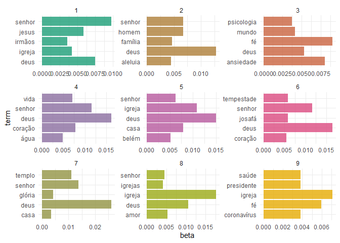
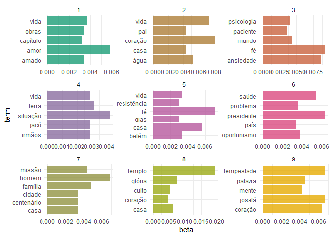

Sample - COVID & Religion in Brazil
================
Gustavo Arruda
2021-03-07

## Introduction

This paper contains a probabilistic topical model of online religious
responses to the pandemic, with a focus on Brazilian
Pentecostal-charismatic groups during the first semester of 2020. The
paper was written on the occasion of a University of Chicago course
called “Computation for the Social Sciences” taught in the fall of 2020.
I collected the data myself while participating in the [Preaching Goes
Viral](https://blogs.miamioh.edu/critical-distance/preaching-goes-viral-responses-to-the-pandemic/)
project, during the summer of 2020.

-   **Appendix 1** displays the code in **COVID\_religion\_topics.R**.
    Running the
    [COVID\_religion\_topics.R](https://raw.githubusercontent.com/arrudafranco/Homework-9/master/COVID_religion_topics.R)
    script loads the data sets and generates the topical model. This
    script is also necessary to produce the graphs within this paper.
-   All files, data or scripts, mentioned in this paper are available at
    this [GitHub
    Repository](https://github.com/arrudafranco/Homework-9).

Used Libraries:

-   To run the code in this repository, the libraries used were:

``` r
library(readxl)
library(tidyverse)
library(tidytext)
library(topicmodels)
library(here)
library(tm)
library(tictoc)
library(RColorBrewer)
```

## Background

I collected the data set used for this analysis during the Summer of
2020 for the [Preaching Goes
Viral](https://blogs.miamioh.edu/critical-distance/preaching-goes-viral-responses-to-the-pandemic/)
project. PGV focused on archiving online religious responses to the
pandemic; this data set in particular focused on Brazilian
Pentecostal-charismatic churches. Pentecostalism is a strand of
Protestantism originated in California in the 1910s focused on
spontaneous present-day gifts of the Spirit, like speaking in tongues,
exorcisms and prophesying. Today, Pentecostalism is represented by
around a third of the Brazilian population; and by a third of the
Brazilian Congress. The objective of this analysis is to uncover the
thematic structure of this corpus, taken out of official websites and
social media profiles of large denominations. To achieve that, I am
using a Latent Dirichlet allocation algorithm, which creates a
probabilistic topical model.

## Analysis

``` r
ggplot(top_terms, aes(term, beta, fill = topic)) +
  geom_bar(alpha = 0.8, stat = "identity", show.legend = FALSE) +
  scale_fill_gradientn(colors = brewer.pal(6, "Dark2")) +
  scale_x_reordered() +
  facet_wrap(~ topic, scales = "free", ncol = 3) +
  coord_flip()
```

<!-- -->

A first model shows the need to not only consider broader Portuguese
stop words, but also stop words particular to this field. The following
model takes that into account, eliminating words like “senhor”, “deus”
and “aleluia”.

``` r
ggplot(top_terms_filtered, aes(term, beta, fill = topic)) +
  geom_bar(alpha = 0.8, stat = "identity", show.legend = FALSE) +
  scale_fill_gradientn(colors = brewer.pal(6, "Dark2")) +
  scale_x_reordered() +
  facet_wrap(~ topic, scales = "free", ncol = 3) +
  coord_flip()
```

<!-- -->

After eliminating some relevant stop words, we have a more useful
topical model of this corpus.

-   **Topic 3** was the first to stand out to me. It says
    *“psychology”*, *“patient”*, *“world”*, *“faith”* and *“anxiety”*.
    The topic seems to refer to mental health, with a large
    preponderance of mentions to “faith” and “anxiety”. We cannot infer
    with certainty the mechanics of the association between the two
    words within this topic in the corpus, but we now have reasons to
    believe faith and anxiety were discursively presented in some
    proximity, either by contrast, association or even causation.

-   **Topic 6** also immediately stands out, with *“health”*,
    *“problem”*, *“president”*, *“country”* and *“opportunism”*. Topic 6
    seems to be largely associated to national politics. It is
    reasonable to sense a sense of dismay in relation to politics, but
    again the discursive mechanics is not graspable with this method.
    For example, “opportunism” and “president” could be used in some
    sort of conflation, in a criticism of Bolsonaro, or of opposition,
    in a criticism of challenges against him and hope for more national
    unity.

-   **Topic 8** shows us *“temple”*, *“glory”*, *“service”*, *“heart”*,
    *“house”*. The underlying relationship among the different words
    seems to be in-person services and social distancing.

-   **Topic 9** mentions the biblical king *Jehosaphat* and *“storm”*,
    which seems to reference the story in which said king won a war
    through deference to God, fasting and prayer. This topic seems to
    point to a particular biblical exegesis emphasizing unity and
    deference to authority. It is uncertain who are the authorities one
    should be deferential towards though: public health specialists,
    Bolsonaro or the pastors?

-   I was not able to make sense of **Topic 1**, **Topic 2**, **Topic
    4**, **Topic 5** and **Topic 7** also uncovered by this model.

## Appendix 1 - COVID\_religion\_topics.R

``` r
library(readxl)
library(tidyverse)
library(tidytext)
library(topicmodels)
library(here)
library(tm)
library(tictoc)

set.seed(1234)

PT_stop_words <- read_excel("PT_stop_words.xlsx") #load Portuguese stop words
COVID_Religion_Data <- read_excel("COVID_religion_data.xlsx",
                                  col_types = c("text", "numeric", "date",
                                                "text", "text", "text", "text", "text",
                                                "text", "date", "text", "text"))

n_grams <- 1:5                          # extract n-grams for n=1,2,3,4,5

corpus_tokens <- map_df(n_grams, ~ COVID_Religion_Data %>%
                         # combine title and body
                         unite(col = title_body, Title, `Text Data`, sep = " ") %>%
                         # tokenize
                         unnest_tokens(output = word,
                                       input = title_body,
                                       token = "ngrams",
                                       n = .x) %>%
                         mutate(ngram = .x,
                                token_id = row_number()) %>%
                         # remove tokens that are missing values
                         drop_na(word))

# remove stop words or n-grams beginning or ending with stop word
corpus_stop_words <- corpus_tokens %>%
  # separate ngrams into separate columns
  separate(col = word,
           into = c("word1", "word2", "word3", "word4", "word5"),
           sep = " ") %>%
  # find last word
  mutate(last = if_else(ngram == 5, word5,
                        if_else(ngram == 4, word4,
                                if_else(ngram == 3, word3,
                                        if_else(ngram == 2, word2, word1))))) %>%
  # remove tokens where the first or last word is a stop word
  filter(word1 %in% PT_stop_words$word |
           last %in% PT_stop_words$word) %>%
  select(ngram, token_id)

# convert to dtm
corpus_dtm <- corpus_tokens %>%
  # remove stop word tokens
  anti_join(corpus_stop_words) %>%
  # get count of each token in each document
  count(id, word) %>%
  # create a document-term matrix with all features and tf weighting
  cast_dtm(document = id, term = word, value = n) %>%
  removeSparseTerms(sparse = .999)

## Joining, by = c("ngram", "token_id")

# remove documents with no terms remaining
corpus_dtm <- corpus_dtm[unique(corpus_dtm$i),]

corpus_lda12 <- LDA(corpus_dtm, k = 9, control = list(seed = 1234))

# A LDA_VEM topic model with 9 topics.

corpus_lda12_td <- tidy(corpus_lda12)

top_terms <- corpus_lda12_td %>%
  group_by(topic) %>%
  top_n(5, beta) %>%
  ungroup() %>%
  arrange(topic, -beta)

top_terms %>%
  mutate(topic = factor(topic),
         term = reorder_within(term, beta, topic))

# removing stop words characteristic of this topic

topical_stop_words <- data.frame(word = c("senhor", "deus", "igrejas", "igreja", "aleluia",
                                          "glória", "jesus", "verso"))
full_stop_words <- union(PT_stop_words, topical_stop_words)

# remove stop words or n-grams beginning or ending with stop word
corpus_full_stop_words <- corpus_tokens %>%
  # separate ngrams into separate columns
  separate(col = word,
           into = c("word1", "word2", "word3", "word4", "word5"),
           sep = " ") %>%
  # find last word
  mutate(last = if_else(ngram == 5, word5,
                        if_else(ngram == 4, word4,
                                if_else(ngram == 3, word3,
                                        if_else(ngram == 2, word2, word1))))) %>%
  # remove tokens where the first or last word is a stop word
  filter(word1 %in% full_stop_words$word |
           last %in% full_stop_words$word) %>%
  select(ngram, token_id)

# convert to dtm
corpus_filtered_dtm <- corpus_tokens %>%
  # remove stop word tokens
  anti_join(corpus_full_stop_words) %>%
  # get count of each token in each document
  count(id, word) %>%
  # create a document-term matrix with all features and tf weighting
  cast_dtm(document = id, term = word, value = n) %>%
  removeSparseTerms(sparse = .999)

## Joining, by = c("ngram", "token_id")

# remove documents with no terms remaining
corpus_filtered_dtm <- corpus_filtered_dtm[unique(corpus_filtered_dtm$i),]

corpus_filtered_lda12 <- LDA(corpus_filtered_dtm, k = 9, control = list(seed = 1234))

# A LDA_VEM topic model with 9 topics.

corpus_filtered_lda12_td <- tidy(corpus_filtered_lda12)

top_terms_filtered <- corpus_filtered_lda12_td %>%
  group_by(topic) %>%
  top_n(5, beta) %>%
  ungroup() %>%
  arrange(topic, -beta)

top_terms_filtered %>%
  mutate(topic = factor(topic),
         term = reorder_within(term, beta, topic))
```
