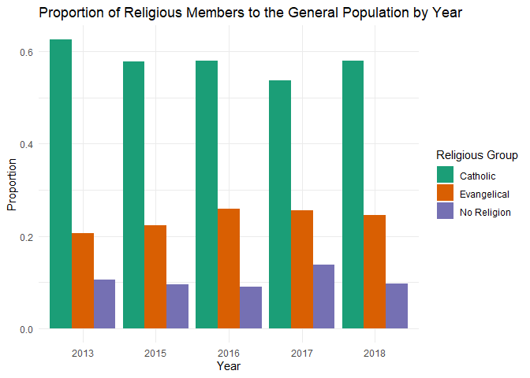
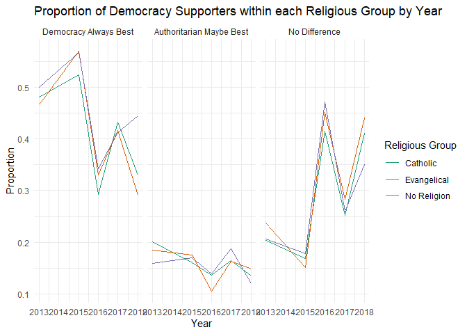
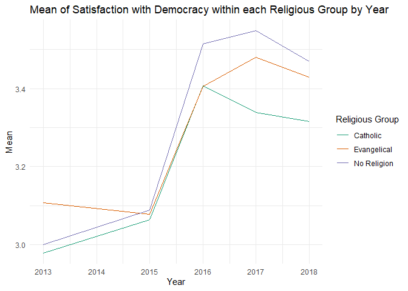

Sample - Brazilian Religion & Faith in Democracy
================
Gustavo Arruda
3/7/2021

## Introduction

This paper contains an exploratory analysis of the relationship between
religious and democracy support variables in Brazil. It was part of a
University of Chicago course called “Computation for the Social
Sciences” taught in the fall of 2020. I used 2013-2018 data from the
[Latinobarometro survey](https://www.latinobarometro.org/), which
measures variations in Latin American political sentiments.

-   **Appendix 1** displays the code in **data\_cleaning.R**. Running
    the
    [data\_cleaning.R](https://raw.githubusercontent.com/arrudafranco/Homework-6/master/data_cleaning.R)
    script loads, standardizes and combines the datasets into an
    analyzable output.
-   **Appendix 2** displays the code in **data\_analysis.R**. The
    [data\_analysis.R](https://raw.githubusercontent.com/arrudafranco/Homework-6/master/data_analysis.R)
    script takes the outputs of data\_cleaning.R, then produces its own
    outputs describing the relations among the variables. Both scripts
    are necessary to produce the graphs within this paper.
-   All files, data or scripts, mentioned in this paper are available at
    this [GitHub
    Repository](https://github.com/arrudafranco/Homework-6).

Used Libraries:

-   To run the code in this repository, the libraries used were:

``` r
library(readxl)
#Used to load the codebook, originally found in xlsx format.
library(sjlabelled)
#Used to strip labels preventing the combination of different datasets.
library(RColorBrewer)
#Used to improve visualization in the Markdown file.
```

## Data

In the 1990s, several Latin American countries went through
re-democratization after long military dictatorships. Their potential
opening to a globalizing economy brought international attention the
region. In the negotiation process of an emerging MERCOSUL, the European
Commission funded the beginning of the **Latinobarometro** initiative.
The initiative followed the successful implementation of the annual
Eurobarometer survey in the 1970s, allied with local efforts to
understand public opinion in regards to democracy and authoritarianism.
Since then **Latinobarometro** has been yearly surveying around 18.000
people in 18 different countries, measuring the local political climate.
More information about this research initiative and the data used in
this analysis can be found freely available at their [official
website](https://www.latinobarometro.org/).

## Research Question

Fears of authoritarianism have been arising again throughout the
international landscape in the last few years. In Brazil more
specifically, the 2018 election of president Jair Bolsonaro has demanded
particular attention from social scientists and observers of democracy.
One of the most puzzling dimensions of this phenomenon has been the
touted alliance of fast rising Evangelical groups with the political
right-wing. **This brief analysis is meant to explore which are the
possible relationships between *religious affiliation* and *sentiments
towards democracy* in Brazil between the 2018 presidential election and
its previous one in 2013.** As a limitation, the Latinobarometro survey
is not especially focused in Brazil, which might carry deficiencies in
sampling compared to a large scale national survey of the same type. On
the other hand, at this point the survey carries expertise in tracking
political sentiment in the region for decades.

## Religious Backgrounds

``` r
ggplot(religion_count) +
  geom_col(aes(x = as.factor(X_002), y = religion_yr_prop,
               fill = as.factor(religion_condensed)), position = "dodge") +
  labs(x = 'Year', y = "Proportion",
       fill = "Religious Group",
       title = "Proportion of Religious Members to the General Population by Year") +
  scale_fill_brewer(palette = 'Dark2',
                    labels = c('1' = 'Catholic', '2' = 'Evangelical', '97' = 'No Religion'))
```

<!-- -->

-   This bar chart shows the proportion of three main religious
    categories in Brazil (my criterion here was proportions over 5%) in
    terms of total population, from 2013 to 2018.
-   The graph suggests a slight proportional growth of Evangelicals
    throughout the observed time span.

## Support to Democracy

``` r
levels_of_support <- c('1' = 'Democracy Always Best', '2' = 'Authoritarian Maybe Best',
                       '3' = 'No Difference')
ggplot(support_democracy_count) +
  geom_line(aes(x = X_002, y = dem_support_prop,
               color = as.factor(religion_condensed))) +
  facet_wrap(~A_001_001, labeller = as_labeller(levels_of_support)) +
  labs(x = 'Year', y = "Proportion",
       color = "Religious Group",
       title = "Proportion of Democracy Supporters within each Religious Group by Year") +
  scale_color_brewer(palette = 'Dark2',
                     labels = c('1' = 'Catholic', '2' = 'Evangelical', '97' = 'No Religion'))
```

<!-- -->

-   In overall terms, the three biggest religious classifications seem
    to be following similar trends.

-   The variation among years is high.

-   Strong support to democracy seems to have been substituted by
    political indifference among all three religious classifications.

-   The only possible exception might be the ‘No Religion’ group, whose
    strong support to democracy continued to increase between 2017 and
    2018 in contrast to the other two groups.

## Satisfaction with Democracy

``` r
dataset_condensed %>%
  filter(A_003_031 > 0 & S_700 %in% main_religions) %>%
  group_by(X_002, religion_condensed) %>%
  mutate(mean = mean(A_003_031)) %>%
  ggplot() +
  geom_line(aes(x = X_002, y = mean, color = as.factor(religion_condensed))) +
  labs(x = 'Year', y = "Mean",
       color = "Religious Group",
       title = "Mean of Satisfaction with Democracy within each Religious Group by Year") +
  scale_color_brewer(palette = 'Dark2', 
                     labels = c('1' = 'Catholic', '2' = 'Evangelical', '97' = 'No Religion'))
```

<!-- -->

-   Subverting expectations, this graph suggests an increase in the
    average answer to a scale measuring satisfaction with democracy for
    all three religious classifications throughout the observed years.

-   Here again the three different religious groups seem follow a
    similar trend.

-   The Catholics might have gone back to a decrease in satisfaction
    with democracy earlier than its peers, between 2016 and 2017.

-   2013 was a year distinguished by the explosion of large-scale
    protests, public discontentment with the then president Dilma
    Roussef of the center-left Workers Party, and the beginning of
    mainstream far-right political articulation. That could explain the
    perceptibly lower overall satisfaction around that time.

-   Between 2015 and 2016 the process of impeachment of Dilma Roussef
    unraveled with broad popular support, which could have helped to
    bounce back general satisfaction with the democratic regime.

## Conclusion

As it is often the case in the social sciences, categories are not
transparent and might have different readings in different contexts. An
issue we can speculate about the research design is the possible
inability of “satisfaction with democracy” scales to measure what has
been called “illiberal democracies” or “populist democracies”. People
might have different standards to evaluate a democratic regime. Thus
measuring their evaluations might get methodologically muddled with a
measure of their own standards, carrying difficulties for broader
conclusions about political sentiments towards authoritarian regimes.
Measures like these would be enriched by a better understanding of
evaluation processes taken by the studied population.

That leads to my initial research question about the relationship
between religious affiliation and sentiments towards democracy between
2013 and 2018. Accepting the presuppositions of the Latinobarometro,
there is *little suggestion* of significant variation among the biggest
three religious classifications.

At last, it could also be the case that political indifference itself is
more characteristic of current day Brazilian authoritarianism than
explicit individual authoritarian alignment.

## Appendix 1 - data\_cleaning.R

``` r
library(dplyr)
library(readxl)
#install.packages("sjlabelled")
library(sjlabelled)
#https://rdrr.io/cran/sjlabelled/man/remove_all_labels.html
#The above package was helpful to deal with the labelled 2018 dataset, before
#combining all of them.


load("F00004532-Latinobarometro_2015_r/Latinobarometro_2015_Eng.rdata")
load("F00005906-Latinobarometro2016_r/Latinobarometro2016Eng_v20170205.rdata")
load("F00006501-Latinobarometro2017_r/Latinobarometro2017Eng_v20180117.rdata")
Latinobarometro_2018_Esp_R_v20190303 <- readRDS("F00008548-Latinobarometro_2018_Esp_R_v20190303/Latinobarometro_2018_Esp_R_v20190303.rds")
load("LAT_Latinobarometro2013_r/Latinobarometro2013Eng.rdata")
F00008653_SerieDeTiempo_1995_2018 <- read_xlsx("F00008653-SerieDeTiempo_1995_2018.xlsx")

codebook <- dplyr::select(F00008653_SerieDeTiempo_1995_2018, -('v1995':'v2011')) %>%
  #Dropping years that will not be analyzed.
  rename_with(~sub("v", "", .x), .cols = 9:13) #Standardizing year variables.

#Still standardizing year variables.
latinobarometro_2015 <- mutate(Latinobarometro_2015_Eng, numinves = 2015, .keep = "unused")
latinobarometro_2013 <- mutate(Latinobarometro2013Eng, numinves = 2013, .keep = "unused")

#Function that standardizes column names defensively before filtering only data from Brazil.
brazil_filter <- function(data_year){
  upper_case_colnames <- rename_with(data_year, .fn = toupper)
  only_brazil <- filter(upper_case_colnames, IDENPA == 76)
  new_name <- paste('BRAZIL', as.character(data_year[1, 1]), sep = "_") #Creates new dataframe.
  assign(new_name, only_brazil, envir=.GlobalEnv)
  #Since each original dataframe only has data from a single year,
  #it makes sense to extract names from the first cell in their year column.
}

brazil_filter(latinobarometro_2013)
brazil_filter(latinobarometro_2015)
brazil_filter(Latinobarometro2016Eng_v20170205)
brazil_filter(Latinobarometro2017Eng_v20180117)
brazil_filter(Latinobarometro_2018_Esp_R_v20190303)

#I made a list of variables of interest, then filtered the codebook.

vars_interest <- c('A_001_001', 'A_003_031', 'H_002_101', 'H_002_111', 'H_002_161',
                   'I_001_001', 'S_700', 'S_701', 'X_002')

codebook_reduced <- filter(codebook, `Indice` %in% vars_interest)

#The following function finds out the year of each data set by selecting its first cell.
#Like previously, it works because the data sets are divided by year.
#The year selects the desirable variables through its column in the codebook_reduced.
#I finish standardizing the variables with a function to substitute each variable
#by its 'Indice' correspondent.

variable_selection <- function(whole_data, first = FALSE){
  year_function <- as.character(whole_data[1, 1])
  filtered_data <- dplyr::select(whole_data, codebook_reduced[[year_function]])
  for (i in vars_interest) {
    old_var <- as.character(codebook_reduced[codebook_reduced$'Indice' == i,][year_function])
    filtered_data <- rename_with(filtered_data, ~sub(paste(old_var), paste(i), .x))
  }
  if (first == TRUE){
    assign('combining_dataset', filtered_data, envir=.GlobalEnv)
    #Start a combined dataset, 
  }
  else{
    if (year_function == '2018'){
      filtered_data <- remove_all_labels(filtered_data)
      #Removes labels from 2018 dataset.
    }
    new_name <- paste('BRAZIL', year_function, 'FILTERED', sep = "_") #Creates new dataframe.
    assign(new_name, filtered_data, envir=.GlobalEnv)
  }
}

variable_selection(BRAZIL_2013, first = TRUE)
variable_selection(BRAZIL_2018)
variable_selection(BRAZIL_2017)
variable_selection(BRAZIL_2016)
variable_selection(BRAZIL_2015)

full_dataset <- bind_rows(combining_dataset, BRAZIL_2018_FILTERED, BRAZIL_2017_FILTERED,
                      BRAZIL_2016_FILTERED, BRAZIL_2015_FILTERED)
```

## Appendix 2 - data\_analysis.R

``` r
library(dplyr)

#Combining the four types of evangelicals was more representative for my purposes.
evangelicals <- c(2, 3, 4, 5)
dataset_condensed <- mutate(full_dataset,
                            religion_condensed = ifelse(S_700 %in% evangelicals, 2, S_700))

year_count_table <- full_dataset %>%
  group_by(X_002) %>%
  count() %>%
  rename('year_count' = n)

religion_count <- dataset_condensed %>%
  group_by(religion_condensed, X_002) %>%
  count() %>%
  left_join(year_count_table, by = 'X_002') %>%
  rename(religion_obs = n) %>%
  mutate(religion_yr_prop = religion_obs / year_count) %>%
  #Filtering out very small religions.
  filter(religion_yr_prop >= 0.05)

#The main religious groups by far are Catholics, Evangelicals and Non-Religious.
#Thus I created the following list for future reference.
main_religions <- c(1, 2, 97)

support_democracy_count <- dataset_condensed %>%
  group_by(religion_condensed, X_002, A_001_001) %>%
  count() %>%
  inner_join(religion_count, by = c("religion_condensed", "X_002")) %>%
  mutate(dem_support_prop = n / religion_obs) %>%
  #Filtering out NAs and very small religions.
  filter(religion_condensed %in% main_religions & A_001_001 %in% c(1, 2, 3))
```
